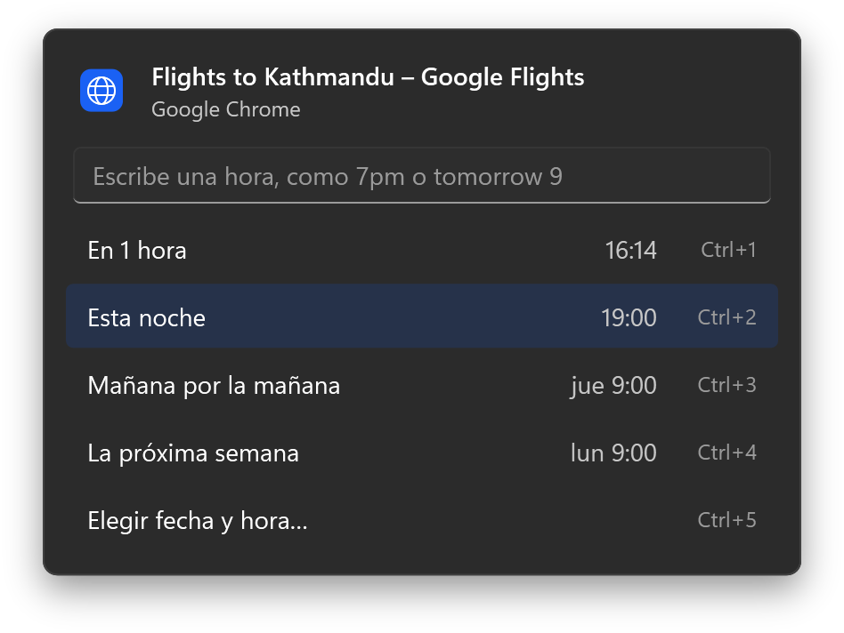
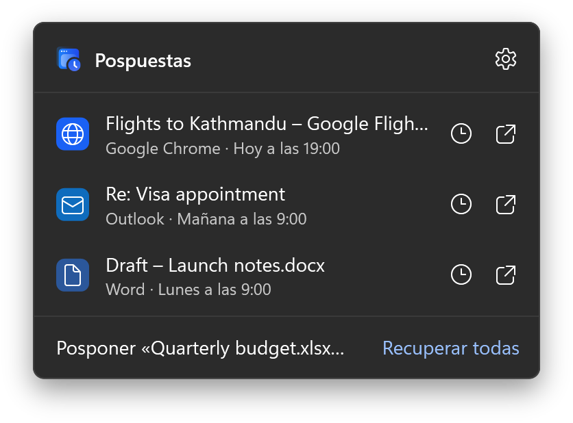
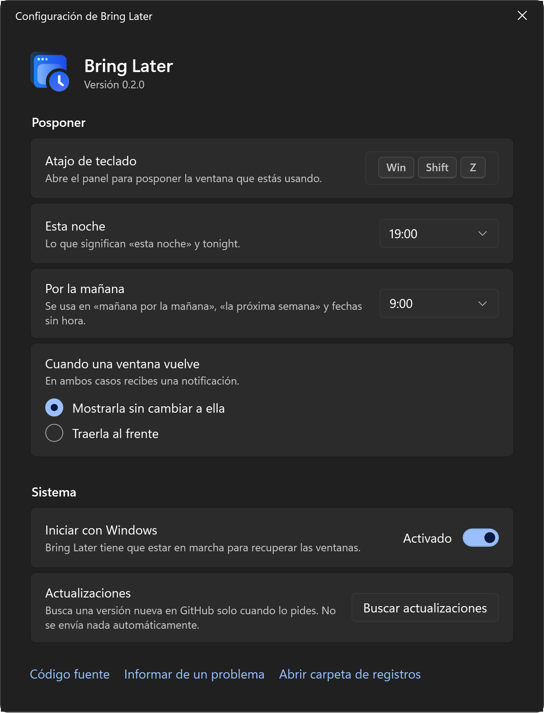

<p align="center">
  <picture>
    <source media="(prefers-color-scheme: dark)" srcset="assets/brand/wordmark-on-dark.svg">
    
  </picture>
</p>

<p align="center"><strong>Pospón una ventana hasta que de verdad la necesites.</strong></p>

<p align="center">
  <a href="README.md">English</a> · <a href="README.zh-CN.md">简体中文</a> · Español · <a href="README.hi.md">हिन्दी</a>
</p>

<p align="center">
  <a href="https://github.com/shivashis-adhikari/bring-later/releases/latest">Descargar</a> ·
  <a href="https://shivashis-adhikari.github.io/bring-later/">Sitio web</a> ·
  <a href="#escribir-una-hora">Escribir una hora</a> ·
  <a href="#compilar-desde-el-código-fuente">Compilar</a>
</p>

<p align="center">
  
</p>

Cuando no necesitas una ventana ahora mismo, tienes tres opciones: dejarla abierta y que llene la pantalla, minimizarla y probablemente olvidarla, o cerrarla y esperar acordarte. Bring Later añade una cuarta.

Pulsa un atajo en la ventana y elige una hora. La ventana desaparece. A esa hora vuelve exactamente a donde estaba y una notificación te avisa. ¿Estás mirando vuelos y no quieres pensar en ello hasta la noche? Pospón esa ventana hasta las 19:00.

- **Windows 11** y **macOS 14 o posterior**, cada una hecha de forma nativa para su sistema
- Gratis y de código abierto con licencia MIT
- Sin cuenta, sin analíticas y sin conexiones a internet salvo que busques actualizaciones

## Cómo funciona

1. Con la ventana delante, pulsa <kbd>Win</kbd> <kbd>Shift</kbd> <kbd>Z</kbd> en Windows o <kbd>⌃</kbd> <kbd>⌥</kbd> <kbd>Z</kbd> en Mac.
2. Elige una opción, escribe una hora o elige una fecha. La ventana se oculta.
3. Cuando llega la hora, la ventana vuelve a su sitio sin quitarte el teclado, y una notificación ofrece **Mostrar** y **Posponer 1 hora**.

Todo lo que pospones aparece en el área de notificación en Windows y en la barra de menús en Mac. Desde ahí puedes recuperar una ventana antes o cambiar su hora.

<p align="center">
  
</p>

## Escribir una hora

Escribe en el panel y Bring Later te muestra exactamente cuándo volverá la ventana antes de pulsar Intro. Por ahora, las horas se escriben en inglés.

| Escribes | Vuelve |
|---|---|
| `30m`, `2h`, `1h30m`, `in an hour` | Pasado ese tiempo |
| `7pm`, `19:00`, `7:30 pm`, `noon` | La próxima vez que sea esa hora |
| `tonight`, `this evening` | Hoy a tu hora de la noche (19:00 si no la cambias) |
| `tomorrow`, `tomorrow 9`, `tomorrow 3pm` | Mañana, a tu hora de la mañana o a la indicada |
| `fri`, `fri 2pm`, `next wed` | Ese día, a tu hora de la mañana o a la indicada |
| `next week` | El lunes a tu hora de la mañana |
| `oct 3`, `3 oct 5pm` | Esa fecha |

## Nada se pierde

- **Al salir, cerrar sesión o si la app falla**, todas las ventanas pospuestas vuelven primero. La posposición se guarda antes de ocultar la ventana, nunca después.
- **Si la app cierra una ventana pospuesta**, igualmente recibes el aviso a la hora que elegiste.
- **Si la recuperas tú**, o la app la vuelve a mostrar, la posposición simplemente termina.
- **Si el equipo estaba en suspensión**, lo que venció vuelve en cuanto se activa.

## Instalación

Bring Later todavía no tiene firma de código, así que el sistema te preguntará una vez antes de abrirla.

### Windows

1. Descarga `BringLater-<versión>-win-x64.exe` (o `-win-arm64.exe` en equipos Arm) desde [Releases](https://github.com/shivashis-adhikari/bring-later/releases).
2. Ejecútalo. Si SmartScreen dice «Windows protegió su PC», selecciona **Más información** y luego **Ejecutar de todas formas**.
3. Bring Later aparece en el área de notificación. No se instala nada; para quitarla, desactiva **Iniciar con Windows** en su configuración, sal y borra el archivo.

Si Control inteligente de aplicaciones está activado, Windows bloquea las apps sin firma y no permite hacer una excepción.

### macOS

1. Descarga `BringLater-<versión>-mac.zip`, descomprímelo y mueve **Bring Later** a Aplicaciones.
2. Ábrela. Cuando macOS la bloquee, abre **Ajustes del Sistema › Privacidad y seguridad** y selecciona **Abrir igualmente**.
3. Permite el acceso de accesibilidad cuando te lo pida. Bring Later lo necesita para mover ventanas de otras apps.

Como no está firmada, macOS olvida el permiso de accesibilidad después de cada actualización. Bring Later lo detecta y te guía para volver a activarlo.

## Configuración



- El atajo de teclado
- Qué significan «esta noche» y «por la mañana»
- Si una ventana que vuelve pasa al frente o espera discretamente detrás de lo que estás haciendo
- Iniciar al iniciar sesión
- Buscar actualizaciones, el único momento en que Bring Later se conecta a internet

Los temas claro y oscuro siguen al sistema, incluidos los temas de alto contraste de Windows.

<br clear="right">

## Privacidad

Bring Later no tiene cuentas ni analíticas, y no hace ninguna petición de red salvo que elijas **Buscar actualizaciones**, que solo lee la lista pública de versiones de este repositorio. Las posposiciones y la configuración se quedan en tu equipo:

- Windows: `%LOCALAPPDATA%\BringLater`
- macOS: `~/Library/Application Support/BringLater` y las preferencias de la app

El registro guarda identificadores de ventana y nombres de archivo de las apps, nunca los títulos de las ventanas.

## Compilar desde el código fuente

Windows (también compila en macOS y Linux):

```bash
dotnet test --project windows/tests/BringLater.Core.Tests
dotnet publish windows/src/BringLater -c Release -r win-x64
```

macOS:

```bash
swift test --package-path mac
mac/scripts/bundle.sh
```

Lee [CONTRIBUTING.md](CONTRIBUTING.md) antes de abrir un pull request.

## Licencia

[MIT](LICENSE) © Shivashis Adhikari
