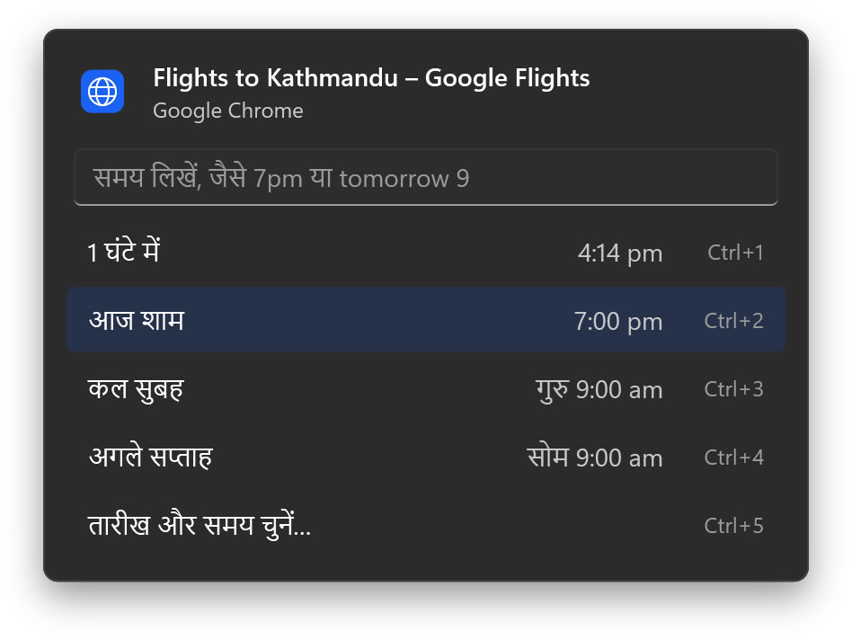
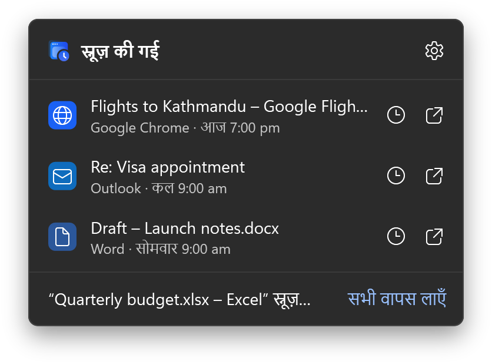
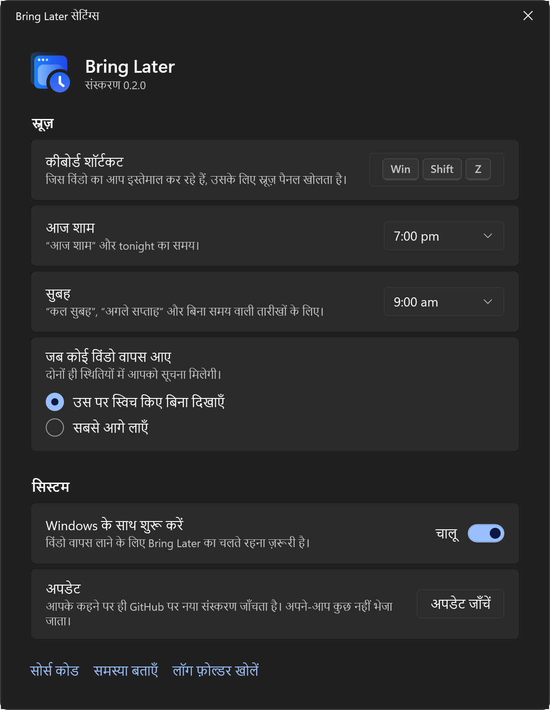

<p align="center">
  <picture>
    <source media="(prefers-color-scheme: dark)" srcset="assets/brand/wordmark-on-dark.svg">
    
  </picture>
</p>

<p align="center"><strong>किसी विंडो को तब तक स्नूज़ करें, जब तक उसकी सच में ज़रूरत न हो।</strong></p>

<p align="center">
  <a href="README.md">English</a> · <a href="README.zh-CN.md">简体中文</a> · <a href="README.es.md">Español</a> · हिन्दी
</p>

<p align="center">
  <a href="https://github.com/shivashis-adhikari/bring-later/releases/latest">डाउनलोड</a> ·
  <a href="https://shivashis-adhikari.github.io/bring-later/">वेबसाइट</a> ·
  <a href="#समय-लिखना">समय लिखना</a> ·
  <a href="#सोर्स-कोड-से-बनाना">सोर्स कोड से बनाना</a>
</p>

<p align="center">
  
</p>

जब किसी विंडो की अभी ज़रूरत न हो, तो आमतौर पर तीन ही रास्ते होते हैं: उसे खुला छोड़ दें और स्क्रीन भरती जाए, उसे मिनिमाइज़ करें और शायद भूल जाएँ, या उसे बंद करें और उम्मीद करें कि बाद में याद रहेगा। Bring Later चौथा रास्ता देता है।

विंडो पर एक शॉर्टकट दबाएँ और समय चुनें। विंडो छिप जाती है। उस समय वह ठीक उसी जगह वापस आती है जहाँ थी, और एक सूचना आपको बताती है। फ़्लाइट देख रहे हैं लेकिन शाम तक उसके बारे में नहीं सोचना चाहते? उस विंडो को शाम 7 बजे तक स्नूज़ कर दें।

- **Windows 11** और **macOS 14 या उसके बाद के संस्करण**, दोनों के लिए अलग से बना नेटिव ऐप
- MIT लाइसेंस के तहत मुफ़्त और ओपन सोर्स
- न कोई खाता, न कोई एनालिटिक्स, और जब तक आप अपडेट न जाँचें तब तक कोई नेटवर्क अनुरोध नहीं

## यह कैसे काम करता है

1. विंडो सामने होने पर Windows में <kbd>Win</kbd> <kbd>Shift</kbd> <kbd>Z</kbd> या Mac में <kbd>⌃</kbd> <kbd>⌥</kbd> <kbd>Z</kbd> दबाएँ।
2. कोई प्रीसेट चुनें, समय लिखें या तारीख चुनें। विंडो छिप जाती है।
3. समय आने पर विंडो आपका कीबोर्ड छीने बिना अपनी पुरानी जगह पर लौट आती है, और सूचना में **दिखाएँ** और **1 घंटे के लिए स्नूज़ करें** के विकल्प होते हैं।

स्नूज़ की गई सभी विंडो Windows में सूचना क्षेत्र में और Mac में मेनू बार में दिखती हैं। वहाँ से आप किसी विंडो को पहले वापस ला सकते हैं या उसका समय बदल सकते हैं।

<p align="center">
  
</p>

## समय लिखना

पैनल में लिखते ही Bring Later दिखा देता है कि विंडो ठीक कब वापस आएगी, Enter दबाने से पहले ही। फ़िलहाल समय अंग्रेज़ी में लिखना होता है।

| आप लिखें | विंडो वापस आएगी |
|---|---|
| `30m`, `2h`, `1h30m`, `in an hour` | इतना समय बीतने के बाद |
| `7pm`, `19:00`, `7:30 pm`, `noon` | अगली बार जब यह समय होगा |
| `tonight`, `this evening` | आज, आपके शाम के समय पर (बदला न हो तो शाम 7 बजे) |
| `tomorrow`, `tomorrow 9`, `tomorrow 3pm` | कल, आपके सुबह के समय पर या बताए गए समय पर |
| `fri`, `fri 2pm`, `next wed` | उस दिन, आपके सुबह के समय पर या बताए गए समय पर |
| `next week` | सोमवार को आपके सुबह के समय पर |
| `oct 3`, `3 oct 5pm` | उस तारीख को |

## कुछ भी खोता नहीं

- **ऐप बंद करने, साइन आउट करने या क्रैश होने** पर स्नूज़ की गई हर विंडो पहले वापस आती है। विंडो छिपाने से पहले ही स्नूज़ सहेज लिया जाता है, बाद में कभी नहीं।
- **अगर ऐप स्नूज़ की गई विंडो बंद कर दे**, तब भी आपके चुने समय पर रिमाइंडर मिलता है।
- **अगर आप खुद उसे वापस ले आएँ**, या ऐप उसे फिर से दिखा दे, तो स्नूज़ वहीं खत्म हो जाता है।
- **अगर उस समय कंप्यूटर स्लीप में था**, तो जागते ही बाकी विंडो वापस आ जाती हैं।

## इंस्टॉल करना

Bring Later पर अभी कोड साइनिंग नहीं है, इसलिए पहली बार खोलने से पहले सिस्टम एक बार पूछेगा।

### Windows

1. [Releases](https://github.com/shivashis-adhikari/bring-later/releases) से `BringLater-<संस्करण>-win-x64.exe` डाउनलोड करें (Arm डिवाइस के लिए `-win-arm64.exe`)।
2. इसे चलाएँ। अगर SmartScreen "Windows ने आपके PC को सुरक्षित किया" दिखाए, तो **अधिक जानकारी** और फिर **फिर भी चलाएँ** चुनें।
3. Bring Later सूचना क्षेत्र में दिखने लगता है। कुछ भी इंस्टॉल नहीं होता; हटाने के लिए उसकी सेटिंग्स में **Windows के साथ शुरू करें** बंद करें, ऐप बंद करें और फ़ाइल डिलीट कर दें।

अगर स्मार्ट ऐप कंट्रोल चालू है, तो Windows बिना साइनिंग वाले ऐप्स को रोक देता है और उन्हें अलग से अनुमति देने का कोई तरीका नहीं है।

### macOS

1. `BringLater-<संस्करण>-mac.zip` डाउनलोड करें, उसे अनज़िप करें और **Bring Later** को ऐप्लिकेशन फ़ोल्डर में ले जाएँ।
2. उसे खोलें। macOS रोके, तो **सिस्टम सेटिंग्ज़ › गोपनीयता और सुरक्षा** खोलें और **फिर भी खोलें** चुनें।
3. पूछे जाने पर ऐक्सेसिबिलिटी की अनुमति दें। दूसरे ऐप्स की विंडो हिलाने के लिए Bring Later को इसकी ज़रूरत होती है।

साइनिंग न होने की वजह से हर अपडेट के बाद macOS ऐक्सेसिबिलिटी की अनुमति भूल जाता है। Bring Later इसे पहचान लेता है और अनुमति फिर से चालू करने में आपकी मदद करता है।

## सेटिंग्स



- कीबोर्ड शॉर्टकट
- "आज शाम" और "सुबह" से कितने बजे का मतलब है
- वापस आने वाली विंडो सबसे आगे आए या आपके मौजूदा काम के पीछे चुपचाप रहे
- साइन इन पर शुरू करना
- अपडेट जाँचना, बस इसी समय Bring Later इंटरनेट से जुड़ता है

हल्की और गहरी थीम सिस्टम के हिसाब से चलती हैं, Windows की हाई-कंट्रास्ट थीम के साथ भी।

<br clear="right">

## गोपनीयता

Bring Later में न कोई खाता है, न एनालिटिक्स। जब तक आप **अपडेट जाँचें** न चुनें, यह कोई नेटवर्क अनुरोध नहीं करता, और तब भी सिर्फ़ इस रिपॉज़िटरी की सार्वजनिक रिलीज़ सूची पढ़ता है। स्नूज़ और सेटिंग्स आपके कंप्यूटर पर ही रहते हैं:

- Windows: `%LOCALAPPDATA%\BringLater`
- macOS: `~/Library/Application Support/BringLater` और ऐप की प्राथमिकताएँ

लॉग में विंडो हैंडल और ऐप की फ़ाइल के नाम दर्ज होते हैं, विंडो के शीर्षक कभी नहीं।

## सोर्स कोड से बनाना

Windows (macOS और Linux पर भी बनता है):

```bash
dotnet test --project windows/tests/BringLater.Core.Tests
dotnet publish windows/src/BringLater -c Release -r win-x64
```

macOS:

```bash
swift test --package-path mac
mac/scripts/bundle.sh
```

पुल रिक्वेस्ट खोलने से पहले [CONTRIBUTING.md](CONTRIBUTING.md) पढ़ें।

## लाइसेंस

[MIT](LICENSE) © Shivashis Adhikari
