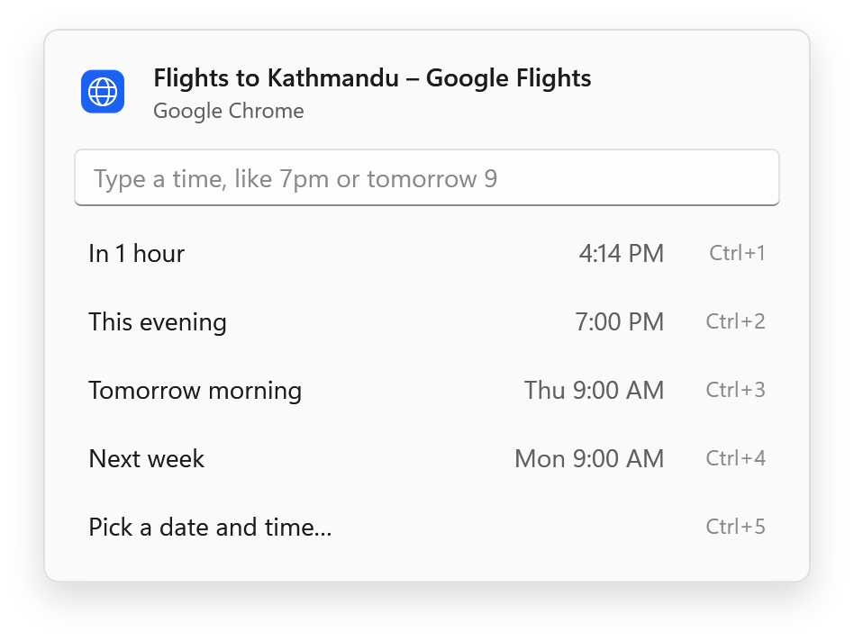
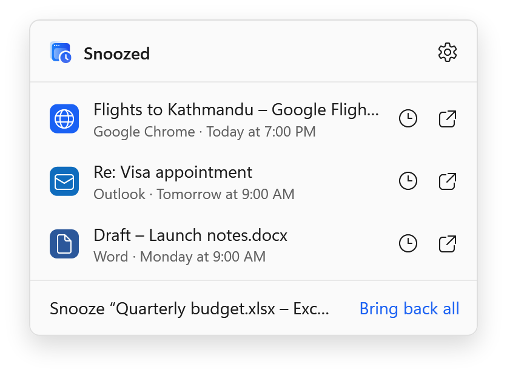
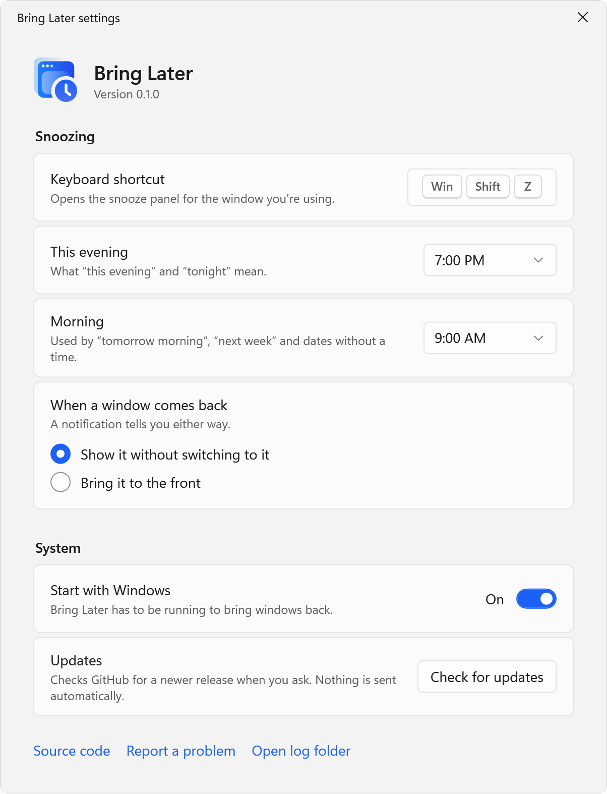

<p align="center">
  <picture>
    <source media="(prefers-color-scheme: dark)" srcset="assets/brand/wordmark-on-dark.svg">
    
  </picture>
</p>

<p align="center"><strong>Snooze a window until you actually need it.</strong></p>

<p align="center">
  <a href="https://github.com/shivashis-adhikari/bring-later/releases/latest">Download</a> ·
  <a href="https://shivashis-adhikari.github.io/bring-later/">Website</a> ·
  <a href="#typing-a-time">Typing a time</a> ·
  <a href="#building-from-source">Build from source</a>
</p>

<p align="center">
  <picture>
    <source media="(prefers-color-scheme: dark)" srcset="docs/images/panel-dark.png">
    
  </picture>
</p>

When a window isn't needed right now, you have three options: leave it open and let it clutter the screen, minimize it and probably forget it, or close it and hope you remember. Bring Later adds a fourth.

Press a shortcut on the window and pick a time. The window disappears. At that time it comes back exactly where it was, and a notification tells you. Researching flights you don't want to think about until tonight? Snooze the tab's window until 7 PM.

- **Windows 11** and **macOS 14 or later**, each built natively for its platform
- Free and open source under the MIT License
- No account, no analytics, no network requests unless you check for updates

## How it works

1. Press <kbd>Win</kbd> <kbd>Shift</kbd> <kbd>Z</kbd> on Windows, or <kbd>⌃</kbd> <kbd>⌥</kbd> <kbd>Z</kbd> on a Mac, while the window is in front.
2. Choose a preset, type a time, or pick a date. The window goes away.
3. When the time comes, the window returns to its old position without taking over your keyboard, and a notification offers **Show** and **Snooze 1 hour**.

Everything you've snoozed is listed in the notification area on Windows and the menu bar on a Mac. From there you can bring a window back early or change its time.

<p align="center">
  <picture>
    <source media="(prefers-color-scheme: dark)" srcset="docs/images/flyout-dark.png">
    
  </picture>
</p>

## Typing a time

Type into the panel and Bring Later shows exactly when the window will come back before you press Enter.

| You type | It comes back |
|---|---|
| `30m`, `2h`, `1h30m`, `in an hour` | After that long |
| `7pm`, `19:00`, `7:30 pm`, `noon` | The next time it's that o'clock |
| `tonight`, `this evening` | Today at your evening time (7 PM unless you change it) |
| `tomorrow`, `tomorrow 9`, `tomorrow 3pm` | Tomorrow, at your morning time or the time given |
| `fri`, `fri 2pm`, `next wed` | That day, at your morning time or the time given |
| `next week` | Monday at your morning time |
| `oct 3`, `3 oct 5pm` | That date |

A bare hour on another day reads the way people schedule: `tomorrow 9` is 9 AM, `tomorrow 3` is 3 PM. Every rule is pinned by [`fixtures/time-grammar.json`](fixtures/time-grammar.json), which the Windows and Mac test suites both run.

## Nothing gets lost

A hidden window with no way back would be worse than clutter, so every path ends with your windows on screen.

- **Quitting, signing out, or a crash** brings every snoozed window back first. The snooze is saved before a window is hidden, never after.
- **If the app closes a snoozed window**, you still get the reminder at the time you picked.
- **If you bring it back yourself**, or the app shows it again, the snooze simply ends.
- **If your computer was asleep**, anything that came due comes back as soon as it wakes.

## Install

Bring Later isn't code-signed yet, so your system asks once before the first launch.

### Windows

1. Download `BringLater-<version>-win-x64.exe` (or `-win-arm64.exe` on Arm) from [Releases](https://github.com/shivashis-adhikari/bring-later/releases).
2. Run it. If SmartScreen says "Windows protected your PC", select **More info**, then **Run anyway**.
3. Bring Later appears in the notification area. Nothing is installed; to remove it, turn off **Start with Windows** in its settings, quit, and delete the file.

If Smart App Control is on, Windows blocks unsigned apps and offers no override.

### macOS

1. Download `BringLater-<version>-mac.zip`, unzip it, and move **Bring Later** to Applications.
2. Open it. When macOS blocks it, open **System Settings › Privacy & Security** and select **Open Anyway**.
3. Allow Accessibility access when asked. Bring Later needs it to move other apps' windows.

Because the build isn't signed, macOS forgets the Accessibility permission after every update. Bring Later notices and walks you through turning it back on.

## Settings

<picture>
  <source media="(prefers-color-scheme: dark)" srcset="docs/images/settings-dark.png">
  
</picture>

- The keyboard shortcut
- What "this evening" and "morning" mean
- Whether a returning window comes to the front, or waits quietly behind what you're doing
- Start at sign-in
- Check for updates, which is the only time Bring Later goes online

Light and dark follow your system, including high-contrast themes on Windows.

<br clear="right">

## Privacy

Bring Later has no account and no analytics, and it makes no network requests unless you choose **Check for updates**, which reads this repository's public releases list. Snoozes and settings stay on your computer:

- Windows: `%LOCALAPPDATA%\BringLater`
- macOS: `~/Library/Application Support/BringLater` and the app's preferences

The log records window handles and app file names, never window titles.

## How it's built

Two native apps that share one behavior contract:

- **Windows:** C# and WPF on .NET 10, published as one self-contained `.exe`. Snoozed windows are hidden with `ShowWindowAsync`; older Microsoft Store (UWP) apps, which can't be hidden that way, are minimized instead.
- **macOS:** Swift 6, AppKit and SwiftUI. There's no public API to hide another app's window, so Bring Later parks it past a corner of the screen through the Accessibility API and minimizes it if it won't move.
- **Shared:** presets, typed times and crash recovery are specified once in [`fixtures/`](fixtures) and tested on both platforms, so they can't drift apart.

The reasoning behind these choices is in [`docs/decisions`](docs/decisions).

## Building from source

Windows (also builds on macOS and Linux):

```bash
dotnet test --project windows/tests/BringLater.Core.Tests
dotnet publish windows/src/BringLater -c Release -r win-x64
```

macOS:

```bash
swift test --package-path mac
mac/scripts/bundle.sh
```

See [CONTRIBUTING.md](CONTRIBUTING.md) before opening a pull request.

## License

[MIT](LICENSE) © Shivashis Adhikari
