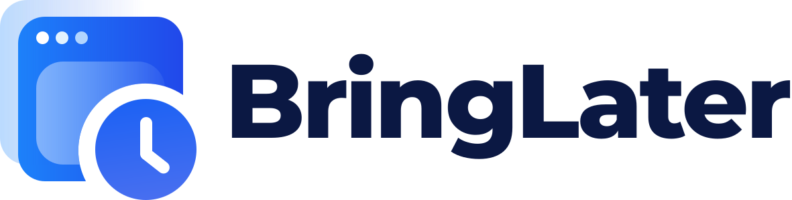
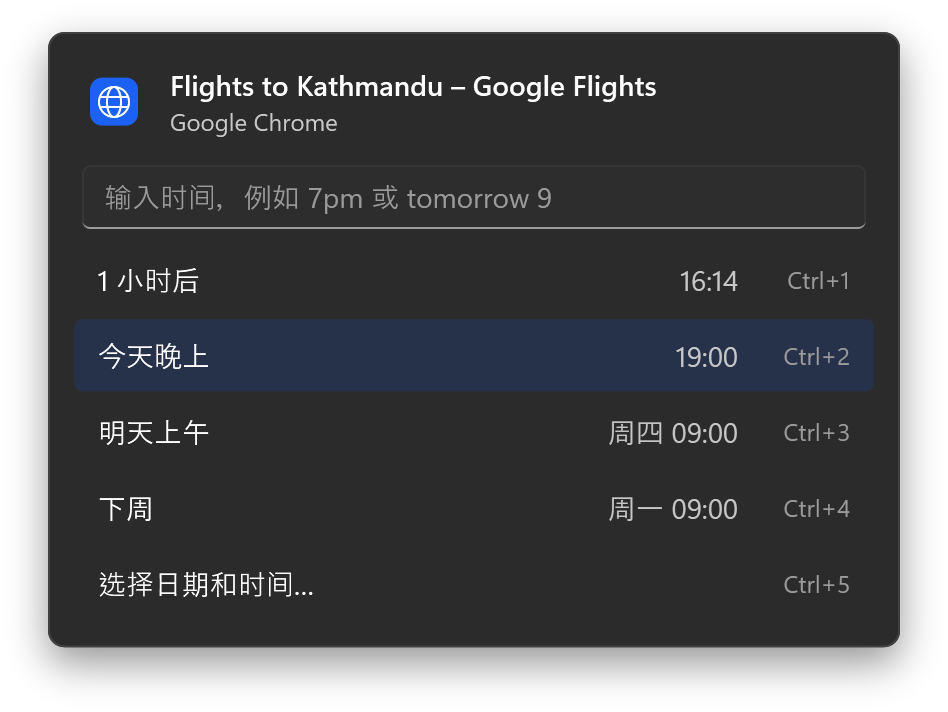
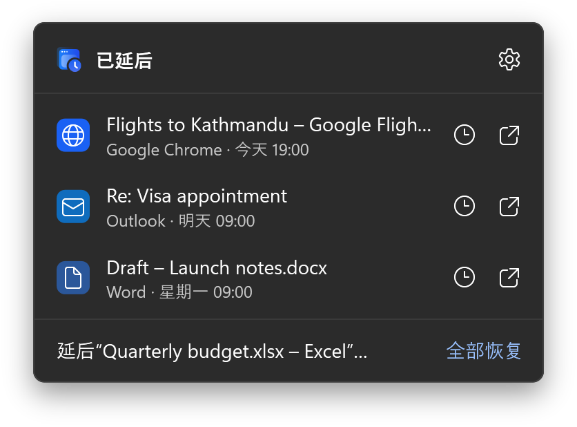
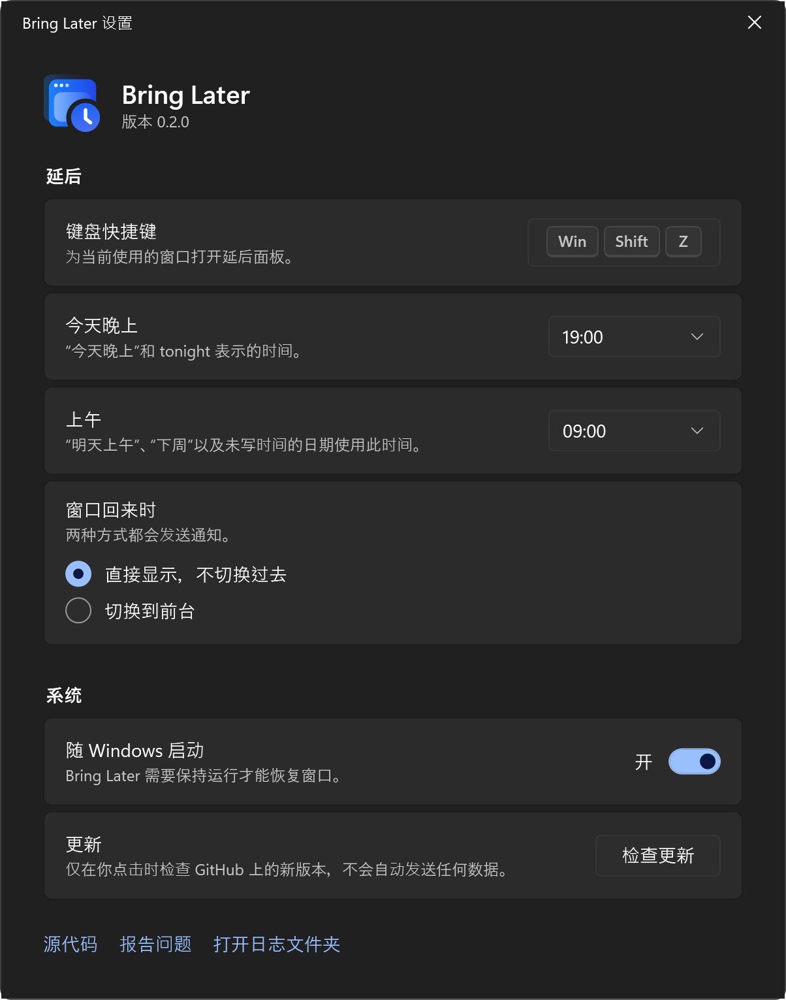

<p align="center">
  <picture>
    <source media="(prefers-color-scheme: dark)" srcset="assets/brand/wordmark-on-dark.svg">
    
  </picture>
</p>

<p align="center"><strong>把窗口延后，等你真正需要时再回来。</strong></p>

<p align="center">
  <a href="README.md">English</a> · 简体中文 · <a href="README.es.md">Español</a> · <a href="README.hi.md">हिन्दी</a>
</p>

<p align="center">
  <a href="https://github.com/shivashis-adhikari/bring-later/releases/latest">下载</a> ·
  <a href="https://shivashis-adhikari.github.io/bring-later/">网站</a> ·
  <a href="#输入时间">输入时间</a> ·
  <a href="#从源代码构建">从源代码构建</a>
</p>

<p align="center">
  
</p>

暂时用不到某个窗口时，通常只有三种选择：一直开着，让屏幕越来越乱；最小化，然后多半忘了它；或者关掉，指望自己以后还记得。Bring Later 提供了第四种选择。

在窗口上按下快捷键并选择一个时间，窗口就会消失。到了那个时间，它会回到原来的位置，并弹出一条通知。比如你在查机票，但想等到晚上再看，就把它延后到晚上 7 点。

- 支持 **Windows 11** 和 **macOS 14 或更高版本**，两个平台都是原生应用
- 免费开源，采用 MIT 许可证
- 无需账户，没有统计分析，除非你手动检查更新，否则不会联网

## 使用方法

1. 让窗口处于最前面，在 Windows 上按 <kbd>Win</kbd> <kbd>Shift</kbd> <kbd>Z</kbd>，在 Mac 上按 <kbd>⌃</kbd> <kbd>⌥</kbd> <kbd>Z</kbd>。
2. 选择一个预设、输入时间或选择日期，窗口随即隐藏。
3. 时间一到，窗口会回到原来的位置，不会抢走键盘焦点；通知中还有**显示**和**延后 1 小时**两个按钮。

所有延后的窗口都列在 Windows 的通知区域或 Mac 的菜单栏中。你可以在那里提前恢复窗口，或者更改它的时间。

<p align="center">
  
</p>

## 输入时间

在面板中输入时间，按 Enter 之前就能看到窗口具体会在什么时候回来。目前时间需要用英文输入。

| 输入 | 回来的时间 |
|---|---|
| `30m`、`2h`、`1h30m`、`in an hour` | 经过这么长时间之后 |
| `7pm`、`19:00`、`7:30 pm`、`noon` | 下一次到达这个时间时 |
| `tonight`、`this evening` | 今天晚上的设定时间（默认晚上 7 点） |
| `tomorrow`、`tomorrow 9`、`tomorrow 3pm` | 明天，使用上午的设定时间或你写的时间 |
| `fri`、`fri 2pm`、`next wed` | 那一天，使用上午的设定时间或你写的时间 |
| `next week` | 下周一上午的设定时间 |
| `oct 3`、`3 oct 5pm` | 那个日期 |

## 不会弄丢任何窗口

- **退出、注销或程序崩溃**时，所有延后的窗口都会先回来。延后记录总是在隐藏窗口之前保存。
- **如果应用关闭了被延后的窗口**，到了你选的时间仍然会收到提醒。
- **如果你自己把窗口恢复了**，或者应用重新显示了它，这次延后就直接结束。
- **如果电脑在那个时间处于睡眠状态**，唤醒后到期的窗口会立刻回来。

## 安装

Bring Later 目前还没有代码签名，所以第一次打开时系统会询问一次。

### Windows

1. 从 [Releases](https://github.com/shivashis-adhikari/bring-later/releases) 下载 `BringLater-<版本>-win-x64.exe`（Arm 设备下载 `-win-arm64.exe`）。
2. 运行它。如果 SmartScreen 显示“Windows 已保护你的电脑”，请选择**更多信息**，然后选择**仍要运行**。
3. Bring Later 会出现在通知区域。它不需要安装；如需删除，在设置中关闭**随 Windows 启动**，退出后删除文件即可。

如果开启了智能应用控制，Windows 会阻止未签名的应用，且无法单独放行。

### macOS

1. 下载 `BringLater-<版本>-mac.zip`，解压后把 **Bring Later** 移到“应用程序”文件夹。
2. 打开它。被 macOS 阻止后，打开**系统设置 › 隐私与安全性**，选择**仍要打开**。
3. 按提示允许辅助功能访问。Bring Later 需要它来移动其他应用的窗口。

由于没有签名，每次更新后 macOS 都会忘记辅助功能权限。Bring Later 会检测到这种情况，并引导你重新开启。

## 设置



- 键盘快捷键
- “今天晚上”和“上午”分别指几点
- 窗口回来时是切换到前台，还是安静地待在你当前工作内容的后面
- 登录时启动
- 检查更新，这是 Bring Later 唯一会联网的时候

浅色和深色主题跟随系统，也支持 Windows 的高对比度主题。

<br clear="right">

## 隐私

Bring Later 没有账户，也没有统计分析。除非你选择**检查更新**（它只读取本仓库公开的版本列表），否则不会发出任何网络请求。延后记录和设置都保存在你的电脑上：

- Windows：`%LOCALAPPDATA%\BringLater`
- macOS：`~/Library/Application Support/BringLater` 以及应用的偏好设置

日志只记录窗口句柄和应用文件名，从不记录窗口标题。

## 从源代码构建

Windows（在 macOS 和 Linux 上也能构建）：

```bash
dotnet test --project windows/tests/BringLater.Core.Tests
dotnet publish windows/src/BringLater -c Release -r win-x64
```

macOS：

```bash
swift test --package-path mac
mac/scripts/bundle.sh
```

提交拉取请求前，请先阅读 [CONTRIBUTING.md](CONTRIBUTING.md)。

## 许可证

[MIT](LICENSE) © Shivashis Adhikari
